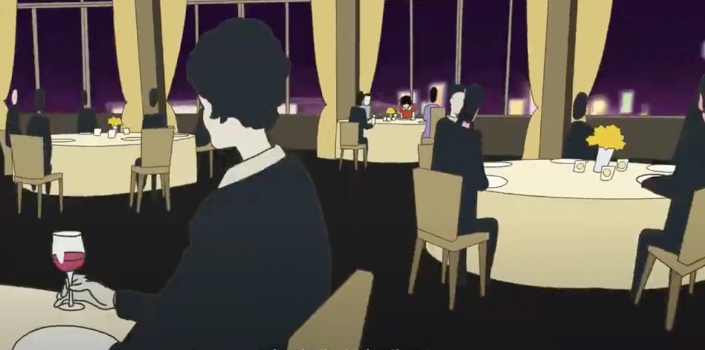
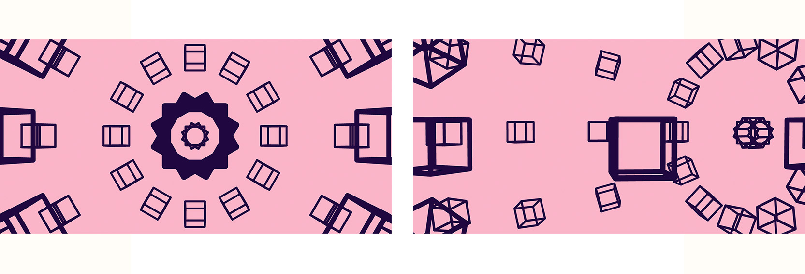

# Quiz 8
## scho0424_9103_tut1

<<<<<<< HEAD
### Part 1: Imaging Technique Inspiration

I found inspiration in the **layout** and **vivid color scheme** from the anime movie _The Night is Short, Walk On Girl_. 

The anime increases visual depth by combining flat graphics with irregularly patterned elements as shown in the image below. For example, it combines the plain train with randomly placed trees in background to fill the space. 

It also expands the sense of space of scene in the restaurant through the use of extreme **zoom-out** techniques.

I aim to create code that enhance **sense of the space** following the user input, based on these visual effects.

### Part 2: Coding Technique Exploration

I aim to effectively implement **the sense of space** that I found in Part 1 using the _Orbit Control code_.

This code makes users adjust their perspective by clicking and dragging the mouse, it looks like a flat geometric pattern. But it transforms into a 3D space in response to user interaction.

This enables **zoom-in and zoom-out effects*** based on user input, similar to the imaging techniques in Part 1.

Additionally, by making the 3D sphere appear flat as the viewpoint changes, it delivers an immersive experience to the user.

[Orbit Control Example](https://p5js.org/examples/3d-orbit-control/)

=======
>>>>>>> c87cc3436af64cc431e68bd6ef5eb1af90ddf7a3
